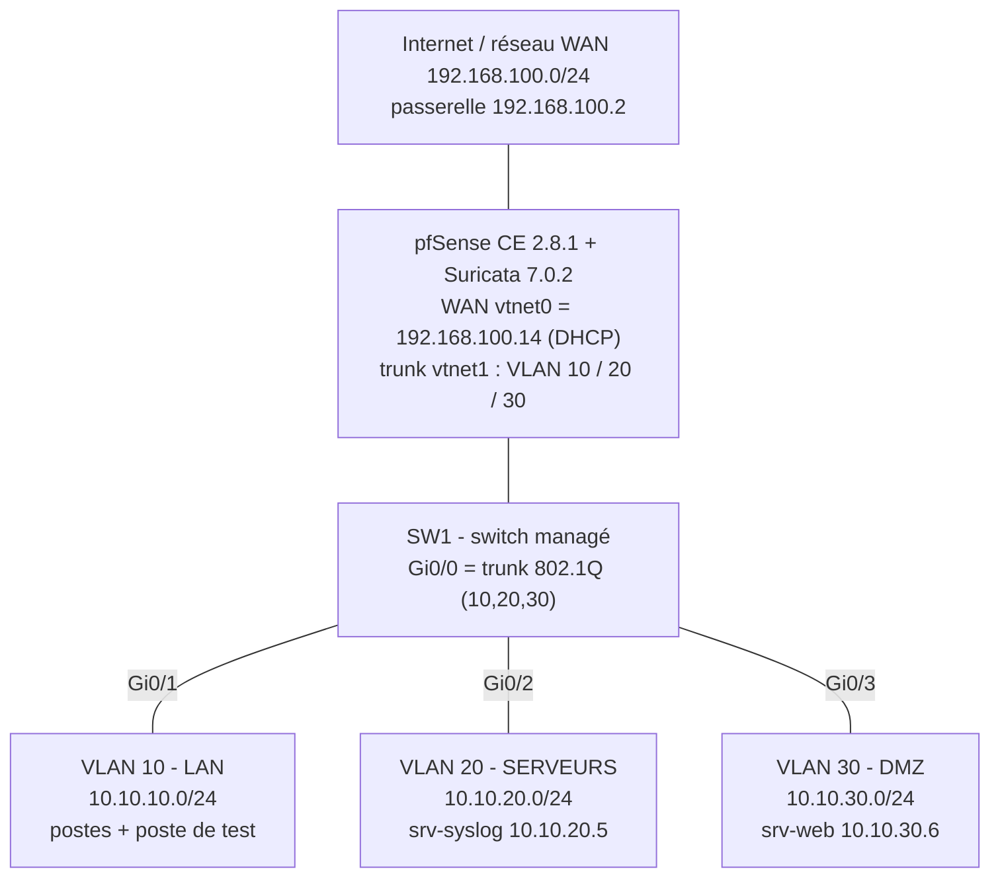
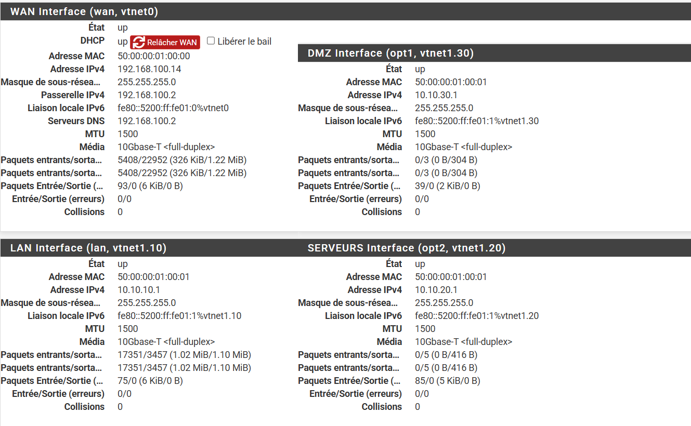
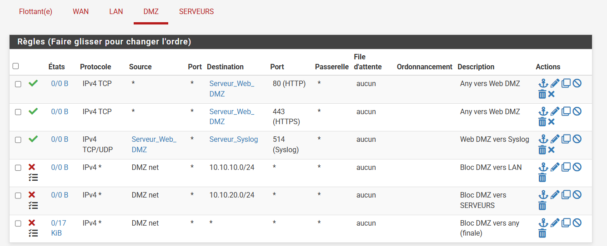
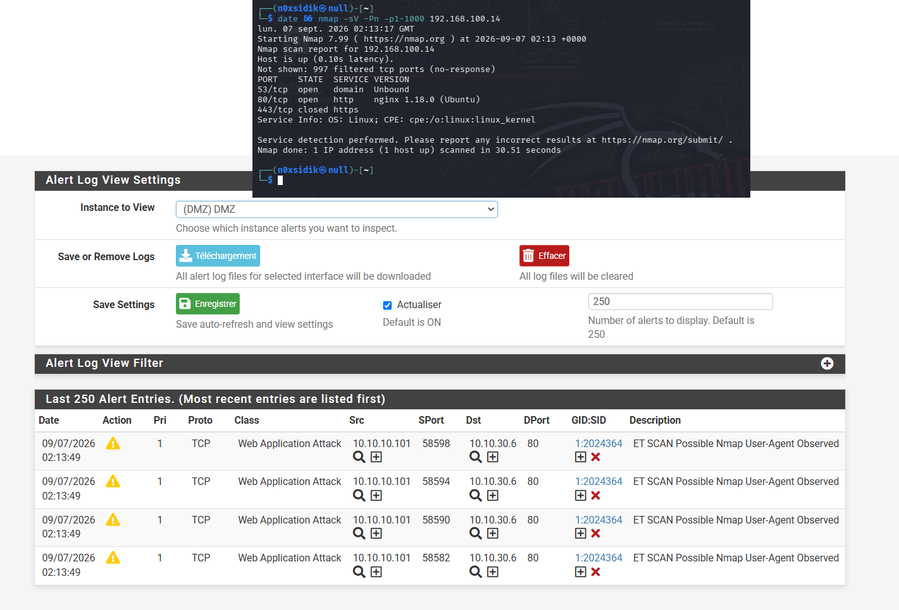
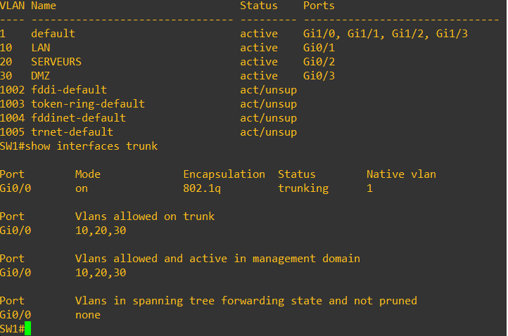
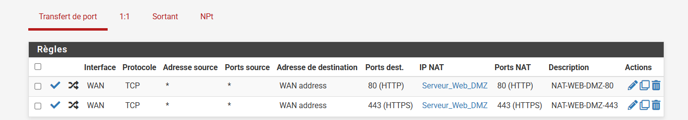
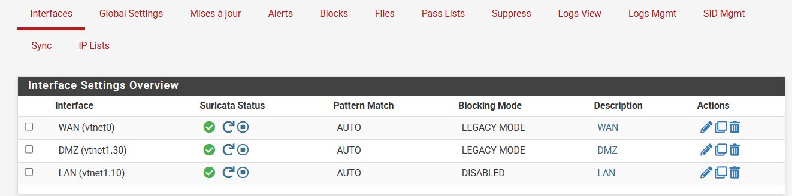
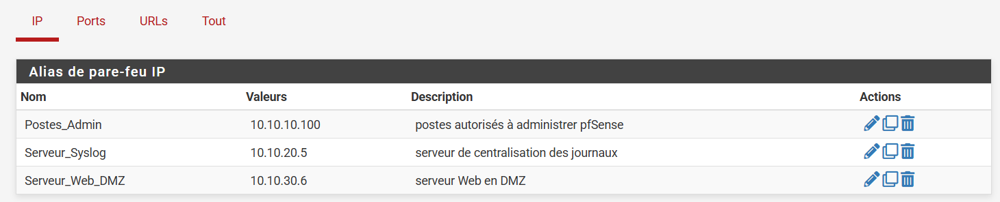
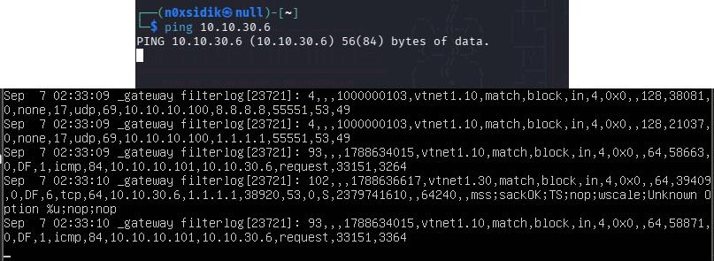
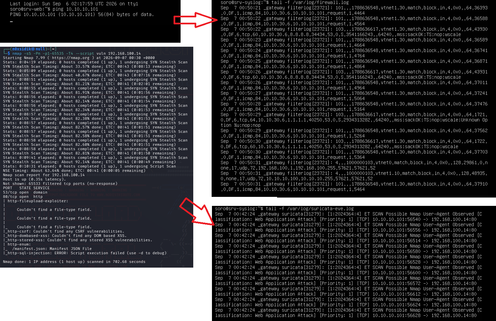

# pfSense + Suricata : segmentation VLAN / DMZ et détection d'intrusion

Pare-feu périmétrique **pfSense** en coupure, segmentation réseau en trois zones (**LAN**, **SERVEURS**, **DMZ**) selon le principe du moindre privilège, détection/prévention d'intrusion avec **Suricata** et centralisation des journaux sur un serveur **Syslog** dédié. Le tout est réalisé et testé sur une **maquette virtualisée** (aucun système de production).

> **Cadre** : projet « Administration avancée et sécurisation des réseaux et systèmes ».
> **Auteur** : DIABY Aboubacar Sidik · **Période des preuves** : 4 au 7 septembre 2026.

**Légende utilisée dans toute la documentation**

| Étiquette | Signification |
|---|---|
| **[RÉEL]** | Établi par une capture, un export de configuration ou un journal présent dans ce dépôt |
| **[À CONFIRMER]** | Information non prouvée par les fichiers du dépôt, à vérifier par l'auteur |
| **[RECOMMANDATION]** | Bonne pratique proposée, non mise en œuvre dans la maquette |
| **[AMÉLIORATION]** | Évolution possible, hors périmètre réalisé |

---

## Sommaire

1. [Objectifs](#objectifs)
2. [Fonctionnalités](#fonctionnalités)
3. [Architecture](#architecture)
4. [Stack technique](#stack-technique)
5. [Prérequis](#prérequis)
6. [Installation et déploiement](#installation-et-déploiement)
7. [Configuration](#configuration)
8. [Vérification et tests](#vérification-et-tests)
9. [Dépannage](#dépannage)
10. [Structure du projet](#structure-du-projet)
11. [Captures d'écran](#captures-décran)
12. [Sécurité](#sécurité)
13. [Limites connues](#limites-connues)
14. [Améliorations futures](#améliorations-futures)
15. [Licence](#licence) · [Auteur](#auteur)

---

## Objectifs

- Reprendre la maîtrise des flux à la frontière du système d'information : passer d'un **réseau à plat** (routeur d'accès à filtrage minimal, aucune séparation entre postes, serveurs et service publié, aucune détection) à une architecture **segmentée et journalisée**.
- Définir une politique de filtrage **au moindre privilège** par zone.
- Isoler la **DMZ**, seule zone dont un service (web, ports 80/443) est publié.
- Ajouter une capacité de **détection** (Suricata + règles ET Open) et **centraliser** les journaux firewall et IDS/IPS.
- **Prouver** le comportement par des tests reproductibles (captures, commandes, journaux).

## Fonctionnalités

**[RÉEL]**

- 3 VLAN 802.1Q sur un trunk unique entre pfSense et le switch SW1 (VLAN 10 LAN, 20 SERVEURS, 30 DMZ).
- 20 règles de filtrage réparties par interface, blocages inter-zones **journalisés** (détail : [`config/regles-pare-feu.md`](config/regles-pare-feu.md)).
- Publication du serveur web DMZ par redirection de ports 80 et 443 depuis l'IP WAN.
- Alias réseau : `Postes_Admin`, `Serveur_Web_DMZ`, `Serveur_Syslog`, `Admin_Ports`.
- Suricata 7.0.2 sur trois interfaces (WAN, DMZ, LAN), règles ET Open, mise à jour planifiée tous les 7 jours à 03:00.
- Envoi des journaux système et pare-feu vers `10.10.20.5:514`.
- Détection démontrée d'un scan Nmap (signature `ET SCAN Possible Nmap User-Agent Observed`, SID `2024364`).

## Architecture



Schémas d'origine : [`diagrams/architecture-existante.png`](diagrams/architecture-existante.png) (réseau à plat) et [`diagrams/architecture-cible.png`](diagrams/architecture-cible.png) (architecture cible). Détail complet : [`docs/architecture.md`](docs/architecture.md).

**Plan d'adressage [RÉEL]**

| Zone | VLAN | Réseau | Passerelle (pfSense) | Interface pfSense | DHCP |
|---|---|---|---|---|---|
| WAN | – | 192.168.100.0/24 | 192.168.100.2 | vtnet0 (`192.168.100.14`) | Client DHCP |
| LAN | 10 | 10.10.10.0/24 | 10.10.10.1 | vtnet1.10 | 10.10.10.100 – 10.10.10.200 |
| SERVEURS | 20 | 10.10.20.0/24 | 10.10.20.1 | vtnet1.20 | Statique |
| DMZ | 30 | 10.10.30.0/24 | 10.10.30.1 | vtnet1.30 | Statique |

**Matrice de flux effective [RÉEL]** (issue de l'export de configuration)

| Source | Destination | Port / protocole | Action |
|---|---|---|---|
| Internet (WAN) | `Serveur_Web_DMZ` 10.10.30.6 | 80, 443 TCP (redirection) | Autorisé |
| LAN | pfSense (DNS) | 53 TCP/UDP | Autorisé |
| `Postes_Admin` 10.10.10.100 | SERVEURS 10.10.20.0/24 | 445, 3389 TCP | Autorisé |
| LAN | Internet | 80, 443 TCP | Autorisé |
| LAN | `Serveur_Syslog` | 514 TCP/UDP | Autorisé |
| LAN | DMZ | tout | **Bloqué (journalisé)** |
| DMZ | `Serveur_Syslog` (depuis le serveur web) | 514 TCP/UDP | Autorisé |
| DMZ | LAN, SERVEURS, tout le reste | tout | **Bloqué (journalisé)** |
| SERVEURS | pfSense (DNS) | 53 TCP/UDP | Autorisé |
| SERVEURS | Internet | 80, 443 TCP (mises à jour) | Autorisé |
| SERVEURS | LAN, DMZ | tout | **Bloqué (journalisé)** |

## Stack technique

| Composant | Version / valeur | Statut |
|---|---|---|
| pfSense CE | **2.8.1** (page de téléchargement capturée ; schéma de config XML `22.9`) | [RÉEL] |
| Suricata (paquet pfSense) | **7.0.2** (`suricata-7.0.2_1`, `pfSense-pkg-suricata 7.0.2`) | [RÉEL] |
| Jeu de règles | Emerging Threats **Open**, mise à jour du 2026-09-06 03:43 UTC | [RÉEL] |
| VM pfSense | 2 vCPU (QEMU Virtual CPU 2.4.0), 4032 MiB de RAM, disque 16 Go (ZFS), 2 cartes virtio (`vtnet0`, `vtnet1`) | [RÉEL] |
| Switch SW1 | Commutateur managé, syntaxe de type Cisco IOS ; modèle/version | [À CONFIRMER] |
| Serveur web `srv-web` | Ubuntu, **nginx 1.18.0** ; IP 10.10.30.6 | [RÉEL] (version d'Ubuntu : [À CONFIRMER]) |
| Serveur Syslog `srv-syslog` | Linux, IP 10.10.20.5, journaux `/var/log/firewall.log` et `/var/log/suricata-eve.log` | [RÉEL] (distribution/démon : [À CONFIRMER]) |
| Poste de test | Kali Linux, **Nmap 7.99**, **Hydra v9.6**, IP 10.10.10.101 | [RÉEL] (IP déduite des journaux) |
| Plateforme de virtualisation | Adresses MAC `50:00:00:xx` et style de topologie compatibles EVE-NG | [À CONFIRMER] |

## Prérequis

- Une plateforme capable d'émuler une topologie réseau avec **VM à cartes virtio**, un **switch managé** (trunk 802.1Q) et une sortie réseau pour le WAN.
- Ressources : pfSense 2 vCPU / 4 Go de RAM / 16 Go de disque minimum (valeurs utilisées).
- ISO pfSense CE 2.8.1 (Netgate).
- Un accès Internet côté WAN (installation du paquet Suricata et téléchargement des règles ET Open).
- Compétences attendues : VLAN/trunking 802.1Q, filtrage stateful, NAT, lecture de journaux, administration Linux de base.

Liste complète et comptes nécessaires : [`docs/guide-deploiement.md`](docs/guide-deploiement.md#0-prérequis).

## Installation et déploiement

Le guide détaillé (à suivre de A à Z) est dans **[`docs/guide-deploiement.md`](docs/guide-deploiement.md)**. Résumé :

1. Préparer la topologie et le câblage (pfSense e0 → WAN, e1 → SW1 Gi0/0 ; SW1 Gi0/1, Gi0/2, Gi0/3 vers les VLAN 10, 20, 30).
2. Configurer SW1 (VLAN 10/20/30, trunk 802.1Q autorisant 10, 20, 30).
3. Installer pfSense CE 2.8.1 (ZFS), affecter `vtnet0` = WAN et `vtnet1` = trunk.
4. Créer les VLAN 10/20/30 sur `vtnet1`, affecter LAN / DMZ / SERVEURS, adresser les interfaces, activer le DHCP sur le LAN.
5. Créer les alias, puis les règles de filtrage par zone (l'ordre compte) et la redirection de ports 80/443.
6. Préparer `srv-syslog` (réception UDP/TCP 514), puis activer la journalisation distante sur pfSense.
7. Installer le paquet Suricata, activer ET Open, créer les instances WAN / DMZ / LAN.
8. Déployer nginx sur `srv-web` (DMZ).
9. Exécuter la campagne de tests ([`tests/plan-de-tests.md`](tests/plan-de-tests.md)).
10. Sauvegarder la configuration **et l'assainir** avant tout partage ([`scripts/sanitize-pfsense-config.py`](scripts/sanitize-pfsense-config.py)).

## Configuration

| Fichier | Contenu |
|---|---|
| [`config/pfsense-config-assainie.xml`](config/pfsense-config-assainie.xml) | Export final pfSense (interfaces, VLAN, alias, règles, NAT, syslog, Suricata), secrets remplacés par `REDACTED` |
| [`config/pfsense-baseline-avant-segmentation-assainie.xml`](config/pfsense-baseline-avant-segmentation-assainie.xml) | État initial de pfSense (LAN 192.168.1.1/24), avant segmentation |
| [`config/regles-pare-feu.md`](config/regles-pare-feu.md) | Les 20 règles, dans l'ordre, avec date de création |
| [`config/suricata.md`](config/suricata.md) | Paramètres globaux et par instance Suricata |
| [`config/sw1-switch.md`](config/sw1-switch.md) | Configuration du switch (sorties `show` réelles + commandes reconstituées) |
| [`config/syslog-serveur.md`](config/syslog-serveur.md) | Côté pfSense (réel) et côté serveur (proposition) |

> Les XML assainis servent de **référence de documentation** : le certificat et les clés étant supprimés, ils ne sont pas importables tels quels.

## Vérification et tests

Campagne complète, commandes et résultats : [`tests/plan-de-tests.md`](tests/plan-de-tests.md).

| # | Test | Résultat observé [RÉEL] | Preuve |
|---|---|---|---|
| T1 | Interfaces pfSense actives | WAN, LAN, DMZ, SERVEURS `up` avec les IP du plan | `screenshots/22-…` |
| T2 | LAN → DMZ (`curl http://10.10.30.6`) | Aucune réponse (délai dépassé après 133 305 ms) | `screenshots/60-…` |
| T3 | LAN → DMZ (`ping 10.10.30.6`) | Aucune réponse ; blocage journalisé (règle « Bloc LAN vers DMZ ») | `screenshots/64-…` |
| T4 | DMZ → LAN (`ping 10.10.10.101` depuis `srv-web`) | Bloqué et journalisé (règle « Bloc DMZ vers LAN ») | `screenshots/61-…` |
| T5 | DMZ → DNS externe (8.8.8.8, 1.1.1.1) | Bloqué par la règle finale de la DMZ | `screenshots/61-…` |
| T6 | Scan Nmap `-sS -Pn -p1-65535 --script vuln` | 65 533 ports filtrés ; 53/tcp et 80/tcp ouverts ; 702,68 s | `screenshots/61-…` |
| T7 | Scan Nmap `-sV -Pn -p1-1000` | 53 Unbound, 80 nginx 1.18.0 (Ubuntu), 443 fermé | `screenshots/63-…` |
| T8 | Détection Suricata du scan | Alerte SID 2024364, priorité 1, visible dans l'instance DMZ et sur `srv-syslog` | `screenshots/62-…`, `61-…` |
| T9 | Latence HTTP vers le web DMZ via WAN (10 essais) | 12,3 à 17,2 ms | `screenshots/30-…` |

## Dépannage

| Symptôme | Cause probable | Solution |
|---|---|---|
| Interface web inaccessible après création des VLAN | LAN déplacé de `vtnet1` vers `vtnet1.10` | Repasser par la console pfSense (option 1/2) ; le poste doit être dans le VLAN 10 |
| Aucun trafic entre pfSense et les VLAN | Trunk ou VLAN absent sur SW1 | `show interfaces trunk` doit lister 10, 20, 30 sur Gi0/0 |
| Un client LAN n'obtient pas de résolution DNS | Le DHCP diffuse 8.8.8.8 / 1.1.1.1, bloqués par la politique (seul le DNS vers pfSense est autorisé) | Publier 10.10.10.1 comme DNS dans le DHCP **[RECOMMANDATION]** |
| Suricata refuse ou ne bloque pas en Inline IPS | Mode Inline (netmap) non retenu sur la maquette | Mode **Legacy** utilisé dans la version finale |
| Aucune alerte Suricata dans les journaux du serveur | Journalisation des alertes vers syslog activée uniquement sur l'instance LAN | Activer « Send alerts to system log » sur WAN/DMZ **[RECOMMANDATION]** |

Dépannage détaillé : [`docs/guide-deploiement.md`](docs/guide-deploiement.md#13-dépannage).

## Structure du projet

```text
pfsense-suricata-segmentation/
├── README.md
├── LICENSE
├── .gitignore
├── docs/
│   ├── rapport-technique.md
│   ├── guide-deploiement.md
│   └── architecture.md
├── config/
│   ├── pfsense-config-assainie.xml
│   ├── pfsense-baseline-avant-segmentation-assainie.xml
│   ├── regles-pare-feu.md
│   ├── suricata.md
│   ├── sw1-switch.md
│   └── syslog-serveur.md
├── scripts/
│   ├── sanitize-pfsense-config.py
│   ├── mesure-latence-http.sh
│   ├── tests-flux-interdits.sh
│   └── tests-scan-nmap.sh
├── tests/
│   ├── plan-de-tests.md
│   └── logs/extraits-journaux.md
├── screenshots/        # captures numérotées par phase
└── diagrams/           # schémas existant / cible / positionnement Suricata / phases
```

## Captures d'écran

| Segmentation | Filtrage | Détection |
|---|---|---|
|  |  |  |
|  |  |  |
|  |  |  |

## Sécurité

**[RÉEL] Mesures en place**

- Refus par défaut sur chaque interface, ouvertures explicites uniquement.
- Isolation de la DMZ : aucun flux DMZ vers LAN ou SERVEURS, règle finale « bloc tout » journalisée.
- Accès d'administration des serveurs limité à l'alias `Postes_Admin` (445, 3389).
- Journalisation distante (événements système et pare-feu) et journalisation des blocages inter-zones.
- Suricata : blocage des adresses sources fautives sur WAN et DMZ (mode Legacy), détection seule sur le LAN.
- Blocage des adresses bogon sur le WAN.

**À savoir avant de réutiliser cette configuration (limites [RÉEL])** : interface web de pfSense en HTTP, SSH activé, règle anti-blocage du LAN (ports 80 et 22 ouverts vers pfSense pour tout le LAN), communauté SNMP `public` présente dans la config. Détail dans [`docs/rapport-technique.md`](docs/rapport-technique.md#10-mesures-de-sécurité-mises-en-place).

**Hygiène du dépôt** : ce dépôt ne contient **aucun** export brut de pfSense. Les exports bruts contiennent le hash du mot de passe administrateur, la clé privée du certificat web et les clés d'hôte SSH. Utiliser `scripts/sanitize-pfsense-config.py` avant tout partage.

**Usage éthique** : les scans et tests d'attaque de ce dépôt ne visent que la maquette. Ne pas les exécuter contre un système qui ne vous appartient pas.

## Limites connues

- Nœud pfSense unique (pas de haute disponibilité).
- Blocage effectif par Suricata **non démontré** par les preuves du dépôt (les alertes sont visibles, les scans ont abouti).
- Test de force brute (Hydra) réalisé uniquement **avant** segmentation ; pas de test équivalent après déploiement de Suricata.
- Aucune mesure de latence ou de CPU **avec** Suricata actif dans les preuves du dépôt.
- Le serveur web ne sert que le port 80 (`443/tcp closed`), bien que la redirection 443 existe.

## Améliorations futures

**[AMÉLIORATION]** interface web en HTTPS et accès restreint à `Postes_Admin` ; DNS du DHCP aligné sur pfSense ; alias « RFC1918 » pour distinguer Internet des réseaux internes ; validation du mode Inline IPS ; export des alertes en EVE JSON vers un SIEM (Wazuh, ELK) ; haute disponibilité CARP ; sauvegarde automatique de la configuration ; campagne de tests après déploiement de Suricata (force brute, scan lent, mesures de performance).

## Licence

Distribué sous licence MIT, voir [`LICENSE`](LICENSE). *(Choix de licence à confirmer par l'auteur.)*

## Auteur

**DIABY Aboubacar Sidik** · https://www.linkedin.com/in/aboudiaby/ · 0101566593
