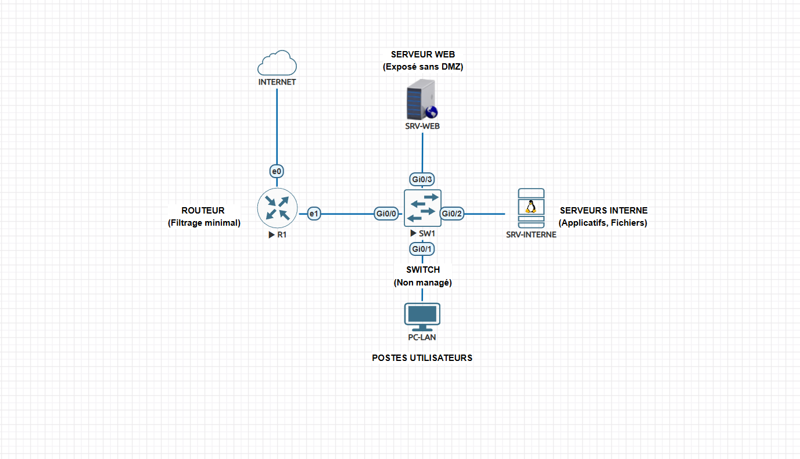
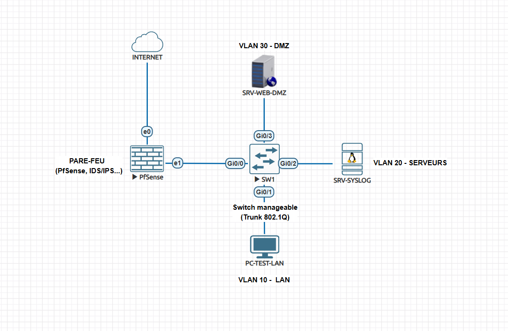
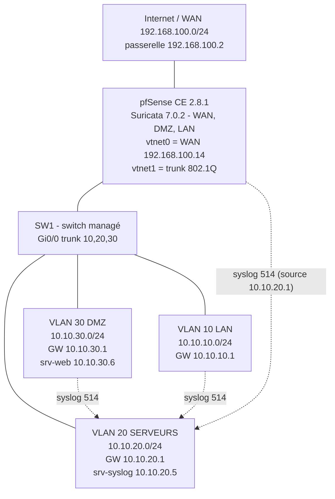
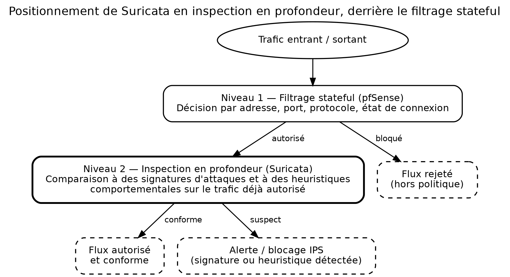

# Architecture

Étiquettes : **[RÉEL]** prouvé par le dépôt · **[À CONFIRMER]** non prouvé · **[RECOMMANDATION]** / **[AMÉLIORATION]** proposé, non réalisé.

## 1. État initial (réseau à plat) [RÉEL]



- Un routeur d'accès (R1) au filtrage minimal relie Internet à un switch **non managé**.
- Serveur web (SRV-WEB, exposé sans DMZ), serveur interne (applicatif, fichiers) et postes utilisateurs partagent le même réseau.
- Aucune segmentation ni détection d'intrusion.

Conséquence constatée lors des tests de référence : sur ce type de réseau, un scan de ports aboutit et une attaque par dictionnaire SSH retrouve un mot de passe (tests A1 et A2 de [`tests/plan-de-tests.md`](../tests/plan-de-tests.md)).

## 2. Architecture cible [RÉEL]





### Composants

| Composant | Rôle | Adresse(s) |
|---|---|---|
| pfSense (`vtnet0`) | WAN, client DHCP, passerelle 192.168.100.2 | 192.168.100.14/24 |
| pfSense (`vtnet1.10`) | LAN (VLAN 10), serveur DHCP 10.10.10.100 – .200 | 10.10.10.1/24 |
| pfSense (`vtnet1.20`) | SERVEURS (VLAN 20) | 10.10.20.1/24 |
| pfSense (`vtnet1.30`) | DMZ (VLAN 30) | 10.10.30.1/24 |
| SW1 | Trunk 802.1Q vers pfSense (Gi0/0), un port d'accès par VLAN (Gi0/1, Gi0/2, Gi0/3) | – |
| `srv-web` | Service web publié (nginx 1.18.0) | 10.10.30.6 |
| `srv-syslog` | Centralisation des journaux (UDP 514) | 10.10.20.5 |
| Poste d'administration | Seul autorisé à joindre les serveurs en 445/3389 (`Postes_Admin`) | 10.10.10.100 |
| Poste de test (Kali) | Scans et tests d'attaque | 10.10.10.101 |

Choix d'architecture **[RÉEL]** : « router-on-a-stick » (un seul lien trunk entre pfSense et le switch), un service publié uniquement en DMZ, les journaux stockés dans une zone (SERVEURS) distincte de celle qui les produit.

## 3. Fonctionnement des flux

### 3.1 Deux niveaux de contrôle



1. **Niveau 1 : filtrage stateful de pfSense** décide selon adresse, port, protocole et état de connexion. Les flux hors politique sont rejetés.
2. **Niveau 2 : inspection en profondeur par Suricata** compare le trafic autorisé à des signatures d'attaque : le flux conforme passe, le flux suspect génère une alerte (et, sur WAN et DMZ, un blocage de la source est configuré en mode Legacy ; son effet n'est pas démontré par les preuves).

### 3.2 Publication du serveur web [RÉEL]

```text
Client ──► 192.168.100.14:80/443 (WAN pfSense) ──► redirection de ports ──► 10.10.30.6:80/443 (srv-web, DMZ)
```

Le serveur web n'écoute que sur le port 80 (`443/tcp closed` lors du scan C7).

### 3.3 Isolation

- DMZ → LAN et DMZ → SERVEURS : bloqués et journalisés. Exception : `srv-web` → `Serveur_Syslog` sur le port 514.
- LAN → DMZ : bloqué et journalisé (y compris pour l'administration).
- SERVEURS → LAN et SERVEURS → DMZ : bloqués et journalisés.
- Matrice complète : [`README.md`](../README.md#architecture) et [`config/regles-pare-feu.md`](../config/regles-pare-feu.md).

### 3.4 Journalisation [RÉEL]

```text
pfSense (source 10.10.20.1) ──UDP 514──► srv-syslog 10.10.20.5
   ├─ événements pare-feu (filterlog) ───► /var/log/firewall.log
   └─ alertes Suricata (instance LAN) ───► /var/log/suricata-eve.log
```

Détails : [`config/syslog-serveur.md`](../config/syslog-serveur.md).

## 4. Emplacement de Suricata [RÉEL]

| Instance | Interface | Rôle | Mode |
|---|---|---|---|
| WAN | `vtnet0` | Trafic entrant depuis Internet | Legacy Mode, blocage des hôtes fautifs |
| DMZ | `vtnet1.30` | Trafic vers/depuis le serveur exposé | Legacy Mode, blocage des hôtes fautifs |
| LAN | `vtnet1.10` | Trafic des postes | Détection seule, alertes vers syslog |

Le mode **Inline IPS** a été observé le 6 septembre puis remplacé par le mode Legacy (voir [`config/suricata.md`](../config/suricata.md)).

## 5. Améliorations d'architecture [AMÉLIORATION]

- Deuxième pare-feu en CARP (haute disponibilité) et deux liens vers le switch.
- Zone d'administration dédiée (VLAN de management) pour l'interface web de pfSense.
- Collecte des journaux vers un SIEM, avec conservation et alertes.
- VLAN native du trunk différente de la VLAN 1 ; désactivation des ports inutilisés du switch.
- Résolution DNS unique via pfSense pour toutes les zones, avec DHCP aligné.
